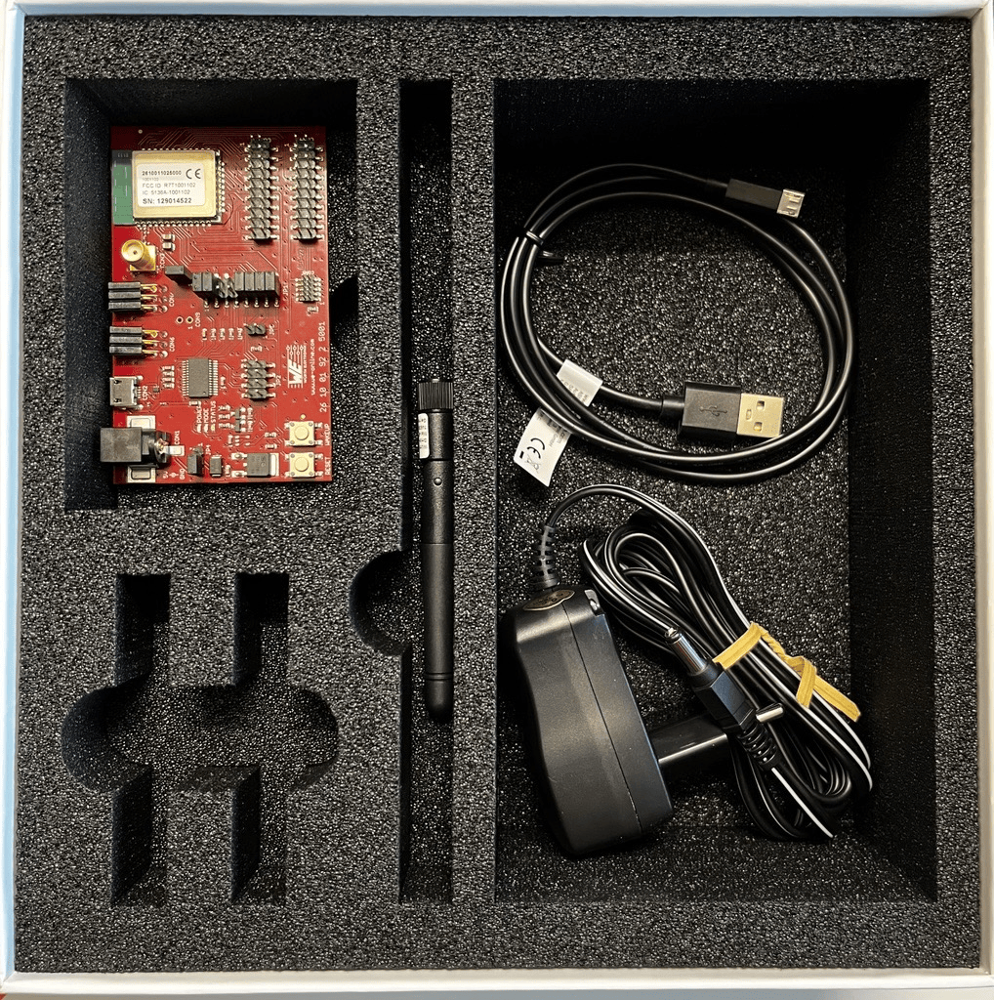
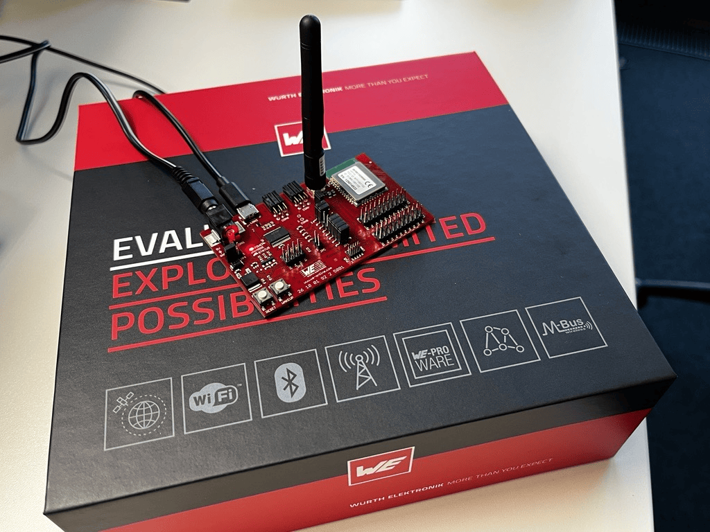
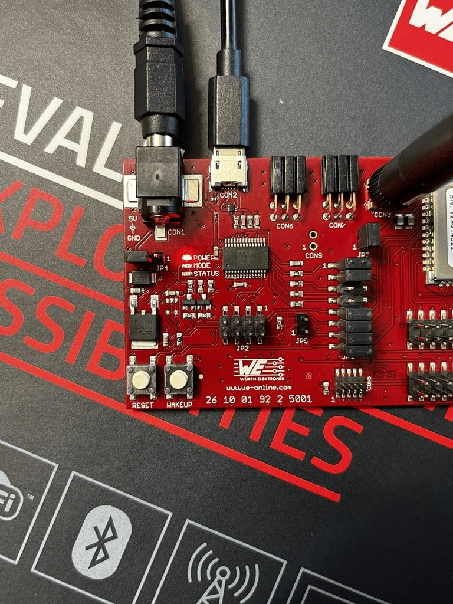
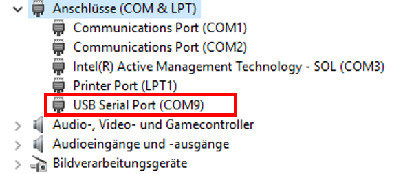
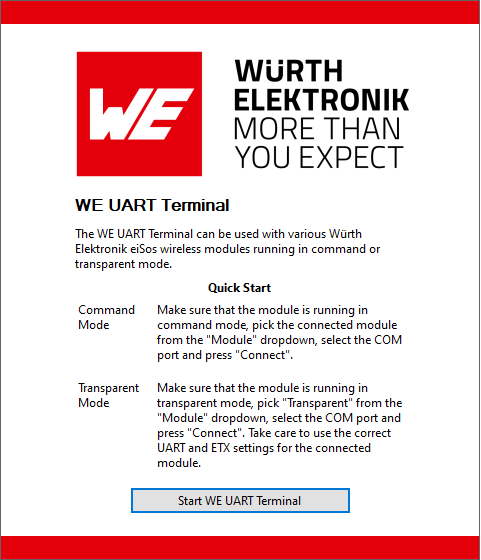
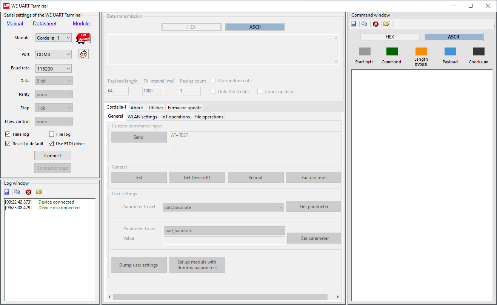
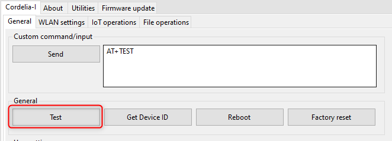
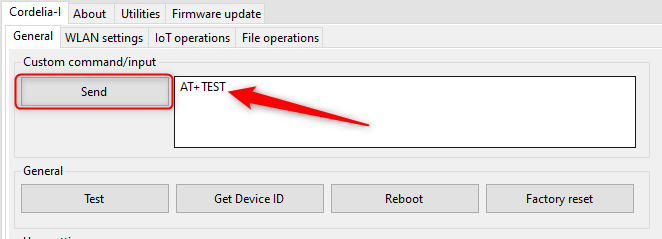
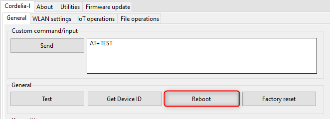

# **Exercise 1**: Connect Cordelia-I EV board to the internet
The goal of this exercise is to power-up the Cordelia-I EV board, connect it to the WE UART terminal running on the computer and finally send AT commands to connect it to the WiFi network.

## Power up the Cordelia-I EV board

The [**Cordelia-I EV-Kit**](https://www.we-online.com/en/components/products/CORDELIA-I#/articles/SIZE_CORDELIA-I_KIT) contains the following items.

- EV-Board with [**Cordelia-I**](https://www.we-online.com/de/components/products/CORDELIA-I) radio module
- [**Himalia**](https://www.we-online.com/de/components/products/WIRL_ACCE_2600130021) 2.4 GHz dipole antenna
- USB-2.0-Typ-A to USB-2.0-Micro-B cable
- Power supply 



1. Connect the antenna provided in the box to the SMA connector (CON3) on the EV-board.
2. Connect your computer to your EV board (CON2) using the USB cable provided in the box.
3. Finally, power-up your EV-board using the power supply provided in the box via the barrel connector (CON1)



Once powered-on, the "Power LED" should turn on.



You can find more information about the Cordelia-I EV-kit in the [user manual](https://www.we-online.com/components/products/manual/2610019225011_Manual_Cordelia_I-EV_2610019225011_V1.0_rev1.pdf).


## **The WE UART Terminal**

The [**WE UART terminal**](https://www.we-online.com/en/products/components/service/wireless-connectivity-sensors?#i8117) is an easy-to-use PC software for Windows that enables complete control of the Würth Elektronik eiSos wireless modules via the command interface. It replaces the well-known Smart commander PC tool. The WE UART Terminal offers an intuitive graphical user interface that enables the user to interact with the wireless modules and understand the communication protocol between the module and a host device using the command interface.

The WE UART Terminal itself is an executable and does not require installation. It will create folders and files on the hard drive e.g. for log file storing.
However, the serial-to-USB FTDI converter chip (i.e. FT232R) on the evaluation platform or USB dongles requires special drivers to be installed for proper operation.
To use USB dongles or EV-Boards of Würth Elektronik eiSos wireless connectivity modules, the Virtual COM Port (VCP) drivers have to be installed by following the "Installation Guides" of FTDI available under: https://www.ftdichip.com/Drivers/VCP.htm

> [!IMPORTANT]
> It is recommended to restart the PC after the installation of drivers.

[**Download**](https://www.we-online.com/components/products/media/674801) the WE UART terminal and unzip the contents to a convenient location.

## **Connect the Cordelia-I EV board to WE UART Terminal**

Connect the Cordelia-I EV-board to your computer using the USB cable provided in the EV-kit. On successful installation of the drivers, the EV-board appears as a USB serial port with a numbered COM port in the device manager. Note the number on the COM port.



Double-click "WEuartTerminal.exe" to start the program. At start-up, a window containing some quick start hints appears. Click on the "Start WE UART Terminal" button to open the main window.






In the serial settings tab perform the following actions to connect to the Cordelia-I EV-board.
1. Select "Cordelia-I" from the "Modules" drop-down menu.
2. Hit the "Refresh" button to find all the serial devices connected to the computer.
3. Select the right COM port and click on "Connect" button. 

> [!IMPORTANT]
> Make sure that the "Use FTDI driver" check box is checked.


At this stage, the EV-board is connected with the WE UART terminal. In order to test the connection click on the "Test" button under the "General tab".



You should see the following logs in the command window.
```
-> AT+TEST
<- OK
```
Congratulations! You are now able to send AT commands to the Cordelia-I module and receive responses.

## **Sending commands to the Cordelia-I module**

The command interface on the Cordelia-I enables full control over the module using ASCII based AT styled commands, followed by a "\r\n".
There are three types of messages exchanged between the Cordelia-I and the host.
- **Requests**: The host requests the module to perform an action or start an operation. All requests start with the "AT+" tag and end with "\r\n".
- **Confirmations**: On each request, the module answers with a confirmation message to give a feedback on the requested operation status. All confirmations contain the request itself and either a "OK" or an error code. All confirmations end with "\r\n". 
- **Events**: The module indicates spontaneously when a special event has occurred. All events start with the "+" tag and contain further data, error codes or status information. All events end with "\r\n".

The WE UART Terminal helps you construct these AT commands using simple UI elements such as text boxes for the parameters and buttons to trigger requests. All responses are logged in the text box with a time stamp.
From this point on, all actions performed on the Cordelia-I module will be using the UI elements of the WE UART terminal. The logs resulting from these actions will be documented here.

However, it is also possible to copy the raw commands from this guide, modify the parameters and send it to the module using the "Custom command/input" section of the WE UART terminal.



## **Reboot Cordelia-I module**

To enable a clean start, reboot the Cordelia-I module by pressing the "Reboot" button. On successful reboot, a start-up event is generated. 



Following a reboot, Set the country code to the applicable region using the AT command below. For sake of this example we use EU as the applicable country code.

```
-> AT+reboot
<- OK
-> +eventstartup:2610011025010,0x31000019,88:01:f9:b3:76:73,1.0.0

-> AT+wlanSet=general,country_code,EU
<- OK
```

## **Connect Cordelia-I module to your WiFi network**

Open the WLAN settings tab in the WE UART terminal.
In order to connect the Cordelia-I module to your WiFi network,
1. Type in the SSID of your WiFi network.
2. Choose the correct security type.
3. Type in your password.
4. Finally click on "Connect".


On successful connection, you will receive a "connect" event as well as an "ipv4_acquired" event.

```
-> AT+wlanconnect=your_ssid,,WPA_WPA2,your_password,,,
<- OK
<- +eventwlan:connect,your_ssid,0x34:0x31:0xc4:0x4a:0xeb:0x5f
<- +eventnetapp:ipv4_acquired,192.168.178.100,192.168.178.1,192.168.178.1
```
Congratulations! Your module is now connected to the internet via your WiFi network. You can confirm this by checking the fact that the "mode" and "status" LEDs are now switched on.


Congratulations on completing this exercise!

[ :arrow_backward: ](README.md) Back to [homepage](README.md)
