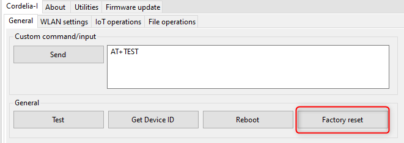
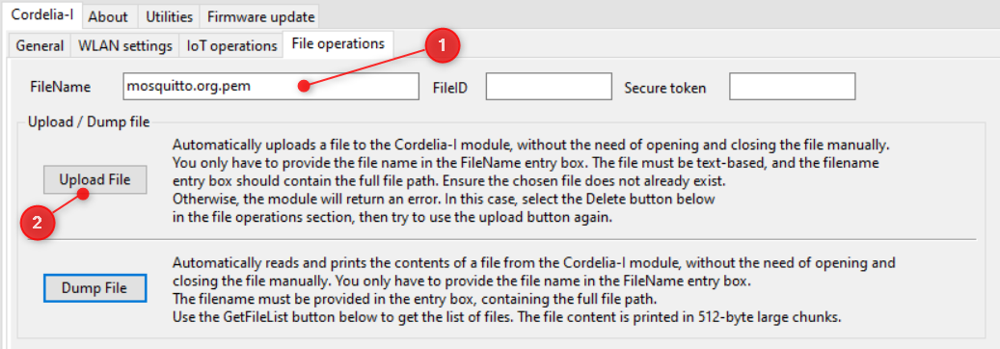
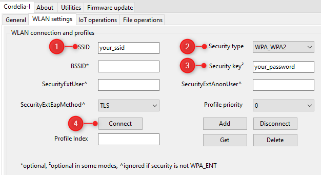
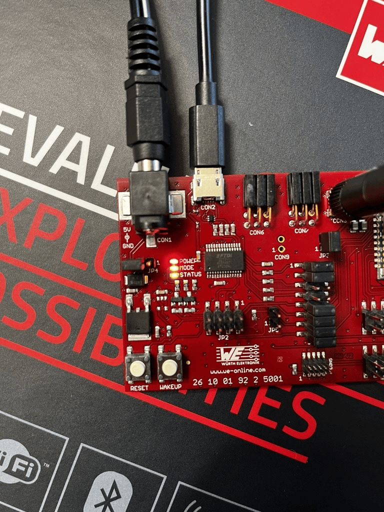

# **Exercise 4**: MQTT over mTLS using Cordelia-I and AWS

In the previous exercise, we created an MQTT connection over an encrypted TLS link. However, this was not a mutually authenticated connection.
The aim of this exercise is to create a fully secure MQTT connection using mTLS.

## TLS
Transport Layer Security (TLS) is a cryptographic protocol designed to provide communications security over a computer network, such as the Internet. The TLS protocol aims primarily to provide security, including privacy (confidentiality), integrity, and authenticity through the use of cryptography, such as the use of certificates, between two or more communicating entities.

The protocol defines the exchange of a sequence of messages over an existing TCP connection resulting in a authenticated and encrypted connection that ensures data integrity.


## Digital certificates

In cryptography, a public key certificate, also known as a digital certificate or identity certificate, is an electronic document used to prove the validity of a public key. The certificate includes the public key and information about it, information about the identity of its owner (called the subject), and the digital signature of an entity that has verified the certificate's contents (called the issuer).

In a typical public-key infrastructure (PKI) scheme, the certificate issuer is a certificate authority (CA), usually a company that charges customers a fee to issue certificates for them.


## Digital certificates and keys in TLS

In order to create TLS connection the client and the server require a set of cryptographic assets. These assets are used during the handshake process to establish a secure connection.

### **Assets at the server**

**Server certificate** : This is a digital certificate that proves the identity of the server and is usually issued by a certificate authority (CA).

### **Assets at the client**

**Client key** : This is a private key that uniquely identifies the client.

**Client certificate** :  This is a digital certificate that proves the identity of the client that contains the public key corresponding to the client key.

**Root CA certificate** : This is the top most certificate  in the server certificate chain used to verify the server. Typically, clients have a catalog of trusted root CA that enable server verification.


## AWS MQTT server/broker

For this hands-on exercise, we will use the [AWS IoT Core](https://aws.amazon.com/iot-core/) service. The AWS IoT core service offers a fully managed MQTT message broker in addition to other device management services. This service acts as the first point of contact for data originating from a device and provides interfaces to other data storage, analysis and presentation services.

:warning: This exercise requires an AWS account.

Please make sure to follow the instructions in the [AWS documentation](https://docs.aws.amazon.com/iot/latest/developerguide/iot-gs.html).


1. Create an AWS account using the instructions [here](https://docs.aws.amazon.com/iot/latest/developerguide/setting-up.html).

2. Create an AWS IoT policy using the instructions [here](https://docs.aws.amazon.com/kinesisvideostreams/latest/dg/gs-create-thing.html).

3. Create an AWS IoT thing and get AWS IoT Core credentials. Follow the steps mention [here](https://docs.aws.amazon.com/kinesisvideostreams/latest/dg/gs-create-thing.html).

At this stage, you should have the following assets from AWS IoT core,

1. Data end point address.
2. Thing name that will be the client ID.
2. Device private key.
3. Device certificate.
4. Root CA of the AWS server.

## Cordelia MQTT client

In this example, we will use the Cordelia-I EV board as the MQTT client.

## Secure connection

The AWS MQTT broker offers a fully secure connection on the port 8883. In this exercise, we will use TLS with mutual authentication. This means that the Cordelia-I client will authenticate the server and the server will perform client verification. A session key is exchanged and the data connection will be encrypted.

You will need the following assets to create this connection.

1. Device private key
2. Device certificate
3. RootCA certificate for AWS

## **Factory reset Cordelia-I module**

> [!IMPORTANT]  
> Perform a "Factory Reset". Please note that the reset will typically take 60 seconds. Please wait for at least this time. The PC tool will not show any reaction during that duration, please be patient. Do not power-off or hard reset the EV-board during this time.
>
> 

## Upload the certificates and keys to Cordelia

In this step, we will upload the device certificate  and keys (download from AWS IoT core) to the Cordelia-I's file system. These files will be used by the on-board MQTT client during the connection set up.

In order to upload the file, in the "File operations" tab on the WE UART terminal, 
1. Type in correct filename in the "FileName" text box.
2. Click on "Upload File" button. This will open the file explorer. Navigate to the location where you stored the certificate. Select the file and click on "OK". 
 
 



```
-> AT+FileOpen=<filename>,WRITE|CREATE,4096
<- +fileopen:363990529,0
<- OK

-> AT+FileWrite=363990529,0,0,1452, <Content to write>
<-+filewrite:1452
<-OK

<-AT+FileClose=363990529,,
<-OK

```
Use this process to write the following files,

1. Device private key with file name "privatekey.pem"
2. Device certificate with file name "cert.pem"
3. RootCA certificate downloaded form [here](https://ssl-tools.net/certificates/ad7e1c28b064ef8f6003402014c3d0e3370eb58a.pem) with file name "rootca.pem"


## **Connect Cordelia-I module to your WiFi network**

Open the WLAN settings tab in the WE UART terminal.
In order to connect the Cordelia-I module to your WiFi network,
1. Type in the SSID of your WiFi network.
2. Choose the correct security type.
3. Type in your password.
4. Finally click on "Connect".



On successful connection, you will receive a "connect" event as well as an "ipv4_acquired" event.

```
-> AT+wlanconnect=your_ssid,,WPA_WPA2,your_password,,,
<- OK
<- +eventwlan:connect,your_ssid,0x34:0x31:0xc4:0x4a:0xeb:0x5f
<- +eventnetapp:ipv4_acquired,192.168.178.100,192.168.178.1,192.168.178.1
```
Congratulations! Your module is now connected to the internet via your WiFi network. You can confirm this by checking the fact that the "mode" and "status" LEDs are now switched on.



## Configure the Cordelia-I module

In this step, we configure the Cordelia-I module to connect to the public AWS IoT Core broker and send/receive data.
The on-board MQTT client on the Cordelia-I module needs to be configured. These parameters are stored in the "user settings" of the module. In the WE UART terminal, use the "Custom command/input" section in the "General" tab to configure the user settings.

The following parameters necessary for this connection:

- MQTT Broker address.
- MQTT port.
- Flags to indicate the type of server used for this connection.
- Set the client ID (Replace "your_client_id" with a meaningful name).
- Full path to the root CA certificate stored on the file system of the Cordelia-I module.
- Full path to the device certificate stored on the file system of the Cordelia-I module.
- Full path to the device private key stored on the file system of the Cordelia-I module.
- Set topic strings to subscribe and publish.


```
-> AT+set=MQTT,iotHubEndpoint,"a2m4kdan3jizyu-ats.iot.eu-central-1.amazonaws.com"
<- OK
-> AT+set=MQTT,iotHubPort,8883
<- OK
-> AT+set=MQTT,flags,"url|sec"
<- OK
-> AT+set=MQTT,clientId,"AWS_thing_name"
<- OK
-> AT+set=MQTT,rootCAPath,"rootca.pem"
<- OK
-> AT+set=MQTT,clientPrivateKey,"privatekey.pem"
<- OK
-> AT+set=MQTT,clientCertPath,"cert.pem"
<- OK
-> AT+set=SUBTOPIC0,name,"cordelia/+"
<- OK
-> AT+set=PUBTOPIC0,name,"cordelia/apple"
<- OK
```

[Optional]You could configure additional topics to publish,
```
-> AT+set=PUBTOPIC1,name,"cordelia/banana"
<- OK
-> AT+set=PUBTOPIC2,name,"cordelia/orange"
<- OK
-> AT+set=PUBTOPIC3,name,"cordelia/kiwi"
<- OK
```


## Connect to the broker and exchange data

At this stage make sure that you are connected to the WiFi. If not connected, follow the steps [here](exercise1.md\#connect-cordelia-i-module-to-your-wifi-network).

Now that the module is configured, Go to the "IoT Operations" tab and click on "Connect" button. On successful connection, you will the module will generate a "CONNACK" event.


```
-> AT+iotconnect
<- OK
<- +eventmqtt:info,"CONNACK",0

```

To exchange data, use the "Publish data" section in the "IoT Operations" tab. Here type in the payload in the text box and click on "Publish custom payload" button to send the data.
Alternatively, use the "Generate and publish random payload" button to send random data.
We are publishing data to the topics that we have subscribed to. Hence, we receive an echo of the sent message.

```
-> AT+iotpublish=0,"{"RandomString":"oUykIeOvzm","Number1":104,"Number2":575}"
<- OK
<- +eventmqtt:recv,cordelia/apple,qos0,"{"RandomString":"oUykIeOvzm","Number1":104,"Number2":575}"

```


Congratulations! Now you have sent data over a fully secure MQTT connection.

[ :arrow_backward: ](README.md) Back to [homepage](README.md)
