# **Exercise 5**: Secure cloud connectivity using Cordelia-I and QuarkLink™

The aim of this exercise is to connect Cordelia-I module securely to the cloud using the [QuarkLink™](https://www.cryptoquantique.com/products/quarklink/) platform.


> [!IMPORTANT]  
> Perform a "Factory Reset". Please note that the reset will typically take 60 seconds. Please wait for at least this time. The PC tool will not show any reaction during that duration, please be patient. Do not power-off or hard reset the EV-board during this time.
>
> 

> [!IMPORTANT]  
>Disconnect the Module from the WE UART terminal!

## Secure device enrolment
From the previous exercises, it is clear that in order to make the connection to the cloud secure, the device and cloud should perform mutual authentication followed by exchange of a session key which is then used to encrypt the communication channel. This is typically performed using the TLS protocol. 

In order to establish a mutual TLS connection, the following cryptographic assets are required to be present on the device and the cloud respectively. The assets also need to be matching with each other.
Cryptographic assets on the device.

- **Device ID**: Unique device identity that is immutable and tamper-proof.
- **Device key**: This is a private key that is unique to every device and needs to be secret.
- **Device certificate**: This certificate contains the public key corresponding to the device private key.
- **Root CA**: This is the root CA of the cloud used to authenticate the cloud end point.

The process of storing these parameters on to the end-device is called **device provisioning**.

Cryptographic assets on the cloud end point.
- **List of Device IDs**: A white list containing Device IDs to allow for connections.
- **Device certificates**: Public keys corresponding to the device IDs to enable device authentication.

The process of storing these parameters on to the cloud end point is called **cloud onboarding**.

These cryptographic assets need to be securely stored on to the device as well as the cloud end point. The exposure of these assets in any phase of the device manufacturing life-cycle can potentially break the security. Often, human interaction with these cryptographic assets poses the largest threat. Hence, the following steps needs to be followed to ensure maximum security.

The Cordelia-I module with the QuarkLink™ platform enable secure cloud connectivity using Zero touch device provisioning and secure cloud onboarding. Further, a complete device management including remote cloud migration can be performed during the entire life-cycle of a Cordelia-I.

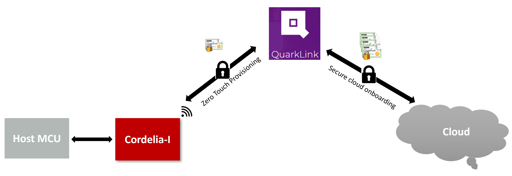


## Zero touch device provisioning

This process involves configuring the device with all the parameters required to connect to the cloud platform including the cryptographic assets without any human interaction. This involves configuring several parameters including the cryptographic assets on the device.

The Cordelia-I module along with QuarkLink™ platform enable zero touch provisioning in the field. Each module comes with a unique pre-installed and hardware tamper-proof set of keys. The private key is fixed to the hardware and cannot be read out by the application. The application software can access only the public key and can use the private key for further cryptographic operations.

**Device ID**: is generated by performing a one-way mathematical function on the device public key and stored in the secure file system of the Cordelia-I module.

**Device key**: is the private key that is pre-installed into the hardware and made tamper-proof. This cannot be read out even by the module application but leveraged to perform device authentication during secure cloud connectivity.

**Device certificate**: is created by the QuarkLink™ platform during the enrolment process

**Root CA**: is loaded by the QuarkLink™ platform during the enrolment process


## Secure cloud onboarding

This process involves configuring the cloud end point to allow authenticated connection on end-devices. This process involves storing the device parameters in the cloud end point. The QuarkLink™ platform allows secure device onboarding on to most of the popular cloud service providers including self-hosted servers. This is handled using authenticated REST APIs exposed by the cloud service providers. More information on adding a cloud end point can be found in the QuarkLink™ [documentation](https://docs.QuarkLink.io/docs/iothubs).


 ## QuarkLink™ secure connectivity platform

QuarkLink™ is a SaaS secure connectivity platform for IoT devices. It enables companies and enterprises to seamlessly perform the first layer of security for an IoT device to be secure when being deployed into a supply chain. These steps include securely provisioning devices, onboarding those devices to a cloud service provider or their own server-hosted application, then managing those devices over their lifecycle. QuarkLink™ uses advanced cryptography techniques to integrate with any root-of-trust for zero-trust end-to-end security across every IoT
device. This platform offers and on-board MQTT broker for test and prototyping.


In this exercise, we will perform the device secure enrolment process after which the Cordelia-I EV-board will exchange data with the built-in MQTT broker on the QuarkLink™ platform.


## Get your free QuarkLink™ Ignite

Open up a web browser on your PC and go to [QuarkLink™ Ignite](https://signup.quarklink.io/). Here, you can register your personal QuarkLink™ instance for free. After registration, you’ll have a platform where you can configure and maintain all of your Cordelia-I modules, with useful features like an inbuilt MQTT broker and a serial terminal emulator.

After successful registration, you should be able to access your personal QuarkLink™ instance via the link provided at the end of the registration process. This link will look
something like https://abcdefghij1k2l.quarklink.io/

## Configure your QuarkLink™ Ignite
Go to your personal QuarkLink™ instance using that link and log in with the credentials you provided during registration

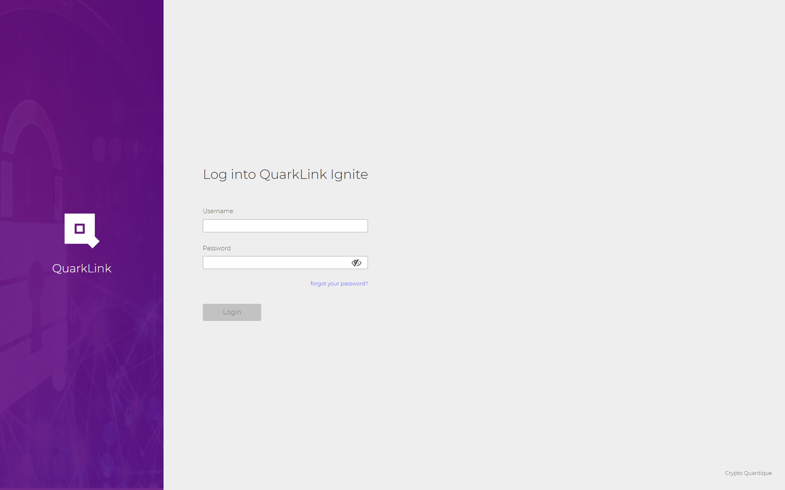


After logging in, you’ll find yourself on the QuarkLink™ main dashboard.

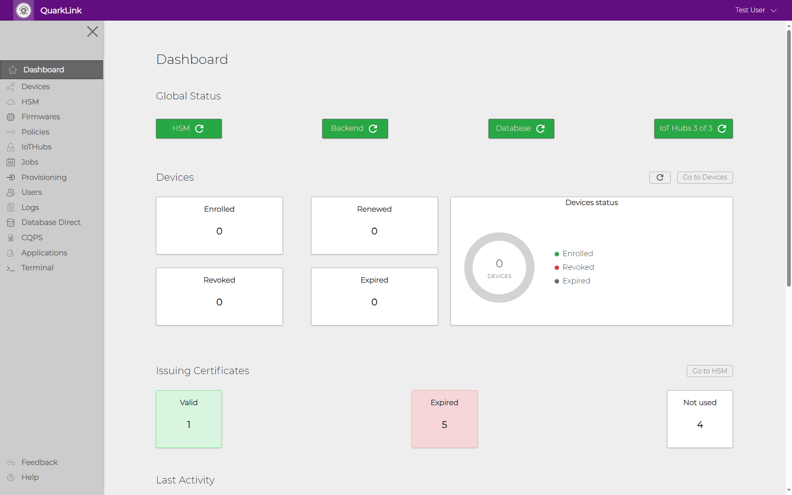

## Add a provisioning task

In order to enable that your Cordelia-I EV-board interacts with your instance of the QuarkLink™ ignite, it needs to be configured with a set of parameters. These parameters are stored in the "user settings" of the module. You can set-up these "user settings" using the WE UART terminal. However, the QuarkLink™ platform automates this process using a "provisioning task".

In this step, we will create a provisioning task in the QuarkLink™ platform.

1. Go to the menu item "Provisioning" and click "New Provisioning Task."

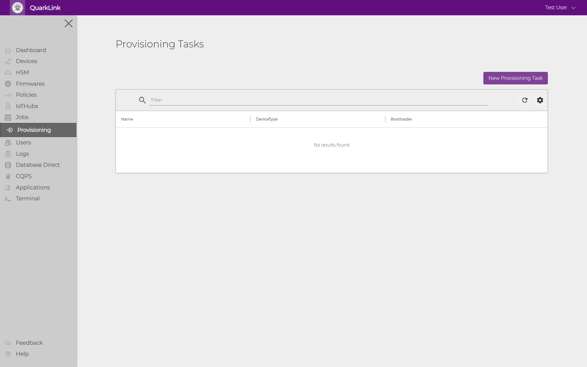

2. In the new window, choose a name for the provisioning task - for example "cordelia-provisioning-task". For the device type, select "Cordelia-I WiFi Module (WE)." For the batch, you can select the "Default" option.

3. Click on "Create New Key" to add a new signing key.

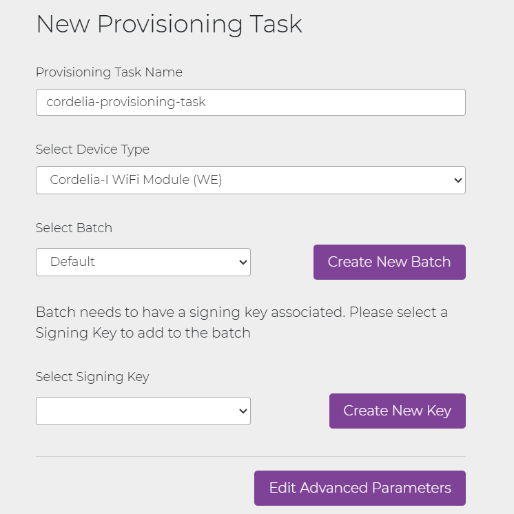

4. In the "Create Signing Key" window, choose a name for the key - for example "cordelia-signing-key". Select "QuarkLink Soft HSM" for key store type and leave the key type and size to default. Click on "Save" to create a signing key.

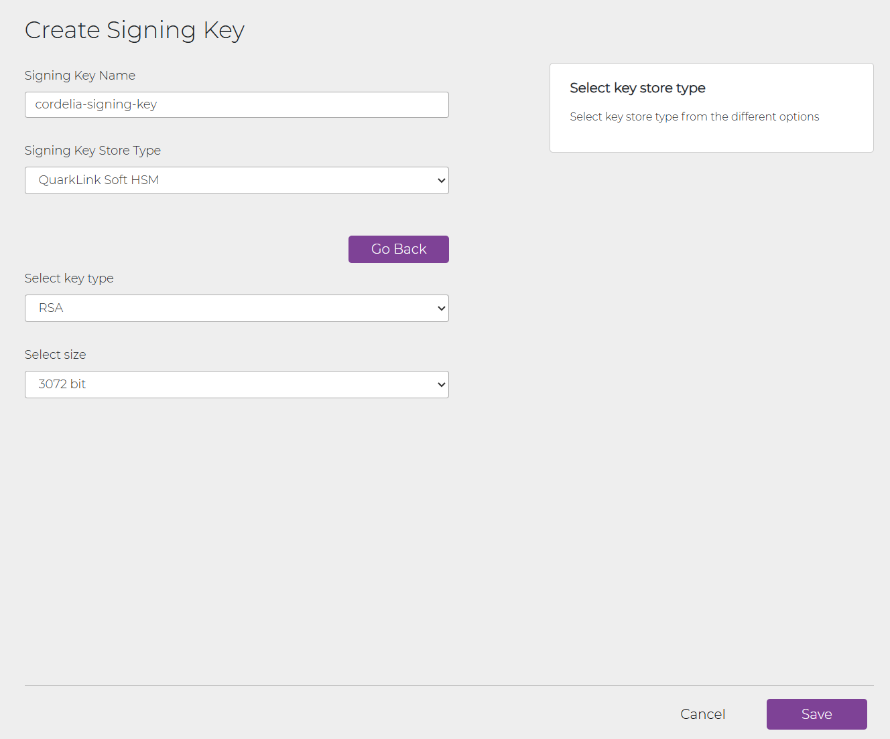

5. Click "Edit Advanced Parameters" to set up parameters for the Certificate Signing Request (CSR) and additional MQTT parameters. Default values are pre-filled for all fields, but you should use your own information. For example, update the country code from
"DE" to your actual country code. The same applies for state, locality, surname, email, organization, and unit.

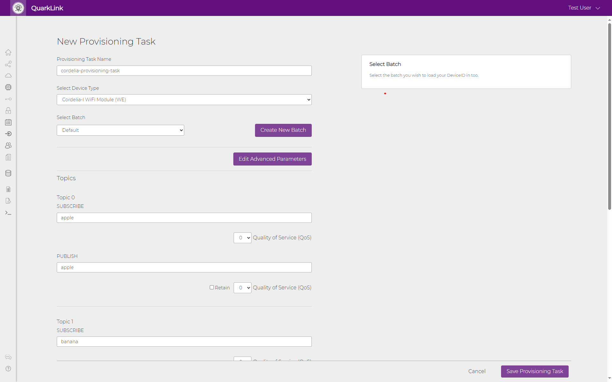


6. In the "Edit Advanced Parameters" window, leave the MQTT Parameters at their default values, then click "Save" to save your settings.

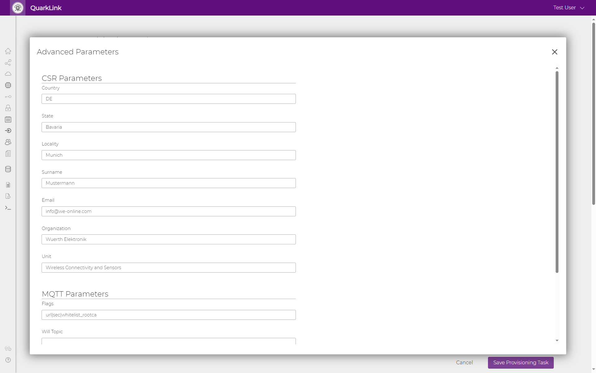

7. By default, the four subtopics and pubtopics (the MQTT topics that the module automatically subscribes to and the four topics it can publish to) are set with some placeholder values. We’ll use these default values, so no changes are needed here.


8. Click "Save Provisioning Task" to save your provisioning task and parameters. You can rerun this provisioning task as often as you like for your Cordelia-I modules without needing
to re-enter parameters each time.


## Configure the Cordelia-I module

1.  Connect your Cordelia-I evaluation board to your PC with
a USB cable. By default, the device starts in AT command mode and uses a virtual COM port (115200 baud, 8N1) for communication with the PC.

2. In the Provisioning menu, at the rightmost side of your newly created provisioning task, click the "Run Provisioning Task" button.

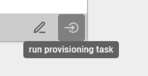

3. In the upcoming window, enter your WLAN SSID and password. The Cordelia-I module will use this information to connect to the WLAN network.

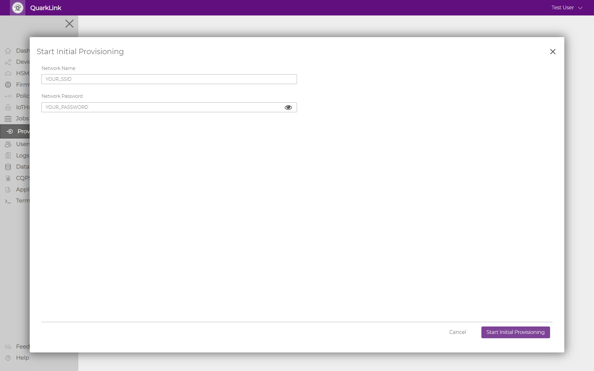

4. Your browser will prompt you for permissions to use the virtual COM port for serial communication. Select the COM port where your Cordelia-I module is connected and allow permissions.

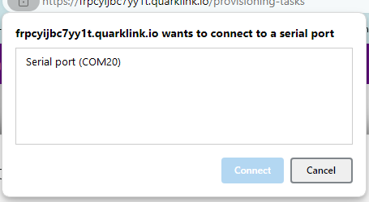

5. The QuarkLink™ portal will now start the automatic provisioning process. You can follow the status of the process in the window. When it finishes, you should see a message indicating that your device has been provisioned and added to the Default batch. Click "Close" to exit this window.

At this stage, the module is fully configured.

## Perform Enrolment process

1. In order to perform the enrolment process, Open the WE UART terminal and connect to the COM port of the EV-board as described [here](exercise1.md/#connect-the-cordelia-i-ev-board-to-we-uart-terminal).

2. Go to the "IoT Operations" tab and click on the "Enrol" button. This will trigger the enrolment process during which the module will be fully provisioned and onboarded.


```
-> AT+iotenrol
<- OK
<- +eventiot:info,"GET_TEMP_CSR",0
<- +eventiot:info,"CREATE_TEMP_CSR",0
<- +eventiot:info,"SENDING_CSR_TO_QL",0
<- +eventiot:info,"CONNECTING_TO_HOST",0
<- +eventiot:info,"HTTP_RESPONSE_CODE",200
<- +eventiot:info,"TEMP_CERT_RECEIVED",847
<- +eventiot:info,"WRITING_TEMP_CERT",0
<- +eventiot:info,"TEMP_CERT_SAVED",0
<- +eventiot:info,"CREATE_DEVICE_CSR",0
<- +eventiot:info,"CONNECTING_QL_TLS",0
<- +eventiot:info,"CONNECTING_TO_HOST",0
<- +eventiot:info,"QL_RESPONSE_RECEIVED",0
<- +eventiot:info,"ENROLMENT_COMPLETE",0
```
Congratulations! Now you have remotely enrolled your device.

## Connect to the broker and exchange data

Now that the module is configured, Go to the "IoT Operations" tab and click on "Connect" button. On successful connection, you will the module will generate a "CONNACK" event.


```
-> AT+iotconnect
<- OK
<- +eventmqtt:info,"CONNACK",0

```

To exchange data, use the "Publish data" section in the "IoT Operations" tab. Here type in the payload in the text box and click on "Publish custom payload" button to send the data.
Alternatively, use the "Generate and publish random payload" button to send random data.
We are publishing data to the topics that we have subscribed to. Hence, we receive an echo of the sent message.

```
-> AT+iotpublish=0,"{"RandomString":"oUykIeOvzm","Number1":104,"Number2":575}"
<- OK
<- +eventmqtt:recv,cordelia/apple,qos0,"{"RandomString":"oUykIeOvzm","Number1":104,"Number2":575}"

```


Congratulations! Now you have sent data over a fully secure MQTT connection. 

## Download credentials for MQTT explorer

The MQTT Broker on QuarkLink™ feature has been designed to allow users to use third party tools to communicate with the QuarkLink™ MQTT Broker. Tools such as Node-RED or MQTT Explorer are ideal for communicating with an MQTT connected device securely. However, the correct security credentials are needed by the third party tool to enable the TLS encrypted link. QuarkLink™ has the capability to create the required credentials for use with the third party tool.

In the QuarkLink™ platform, click on the IoT Hub main menu on the main dashboard.

1. Click in the edit icon for the select IoT Hub of type MQTT. The dialog box shown above will open.
2. Click on the Add Tool button. The dialog box shown above will open.
3. Type in a free text name for your third party tool instance.
4. Click the Save button.
5. The security credentials will be generated by the QuarkLink. Icons are available to copy or download the credentials.

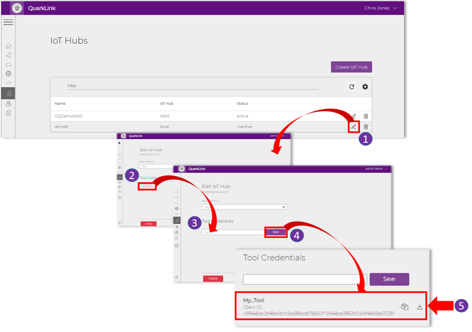

:bulb: Note the Client ID generated here.

6. To download the credentials, click the download icon. A <tool_name>.zip file will be downloaded to the users PC/Laptop

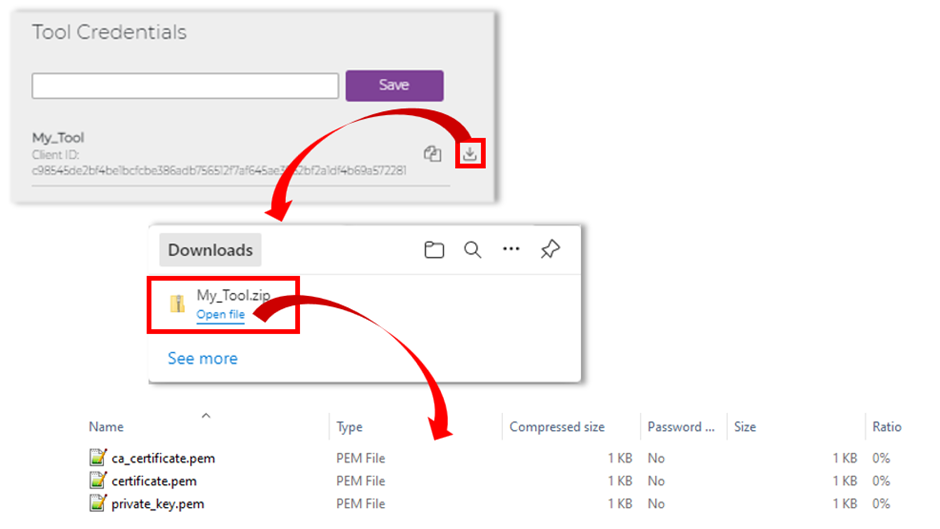


:warning: Please ensure that this Zip file is stored securely and is treated as confidential as it contains private cryptographic keys.

## Connect the MQTT explorer client to QuarkLink™ broker

Open the MQTT explorer tool. In the start-up page add the parameters of the MQTT broker/server.

1. Click on the "+ connections" button.
2. Give a unique name to this connection. For example, "Quarklink".
3. Enter the host name. This is the address of the QuarkLink™ MQTT broker/server "abcdefghij1k2l.quarklink.io/"
4. Enable "Validate certificate" option.
5. Enable "Encryption(tls)" option. 
6. Change the port to "8883"
7. Click on "Advanced" button

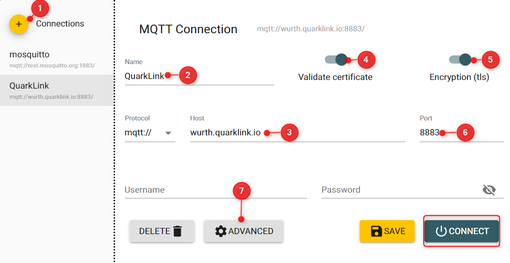


In the advanced view,
5. Delete the default topic "#" in order to prevent receiving all messages published to this public server.
6. Delete the default topic "$SYS/#"
7. Add new topic. In this example we use "apple", "banana", "orange", "kiwi".
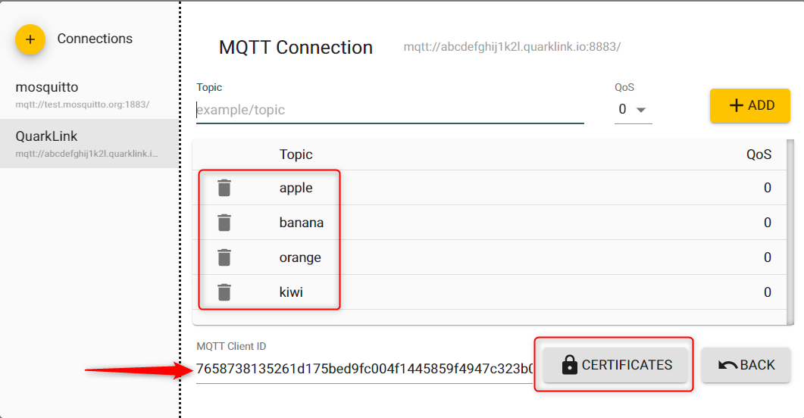

8. Copy the "Client ID" from QuarkLink, generated in the previous step.

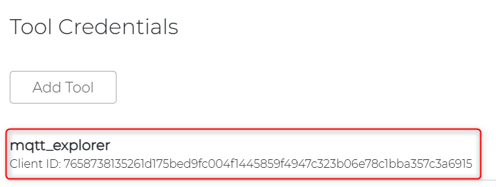


9. Click on "Certificate" button.

10. In the Certificates view, click on each of the buttons to open a file explorer. Here, browse to the location where you downloaded the files in the previous step and select corresponding files and upload the same.

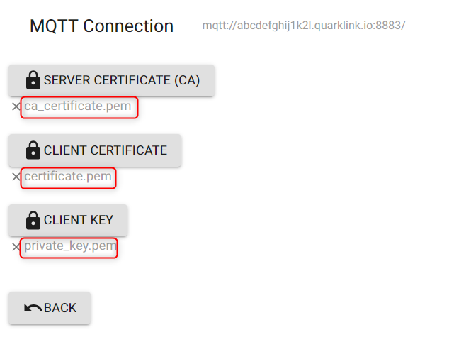

10. Click on the "back" button to return to the main view.

11. Finally click the "Connect" button to connect to the MQTT broker.

## Plot data from Cordelia-I on the MQTT explorer

Since the Cordelia-I module as well as the MQTT explore are connected to the same broker, they can exchange data. 

1. Send some data from the WE UART terminal by clicking on the "Generate and Publish random payload".

2. Now you can view the data and plot the same on MQTT explorer.


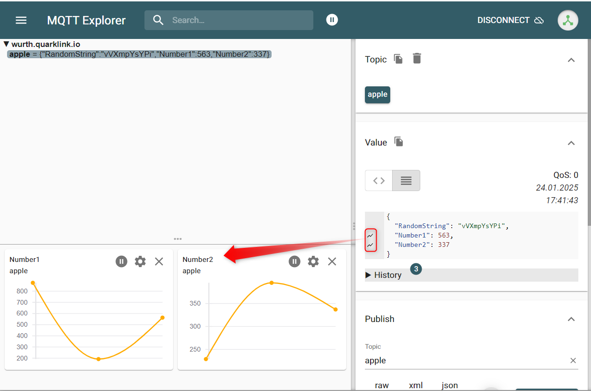


Congratulations! You have now built a complete IoT solution which is secure and scalable.

[ :arrow_backward: ](README.md) Back to [homepage](README.md)